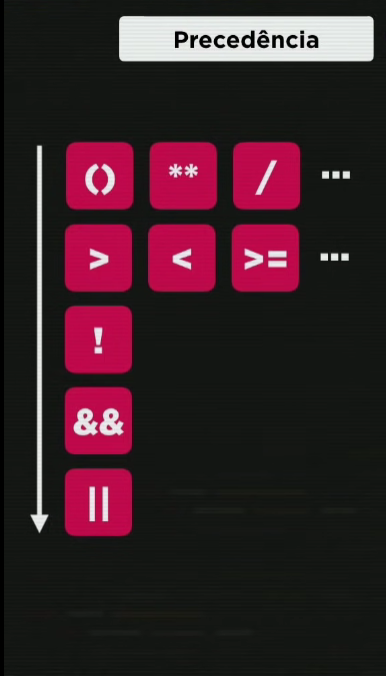

# Conceitos Js

## Comandos do navegador:

```jsx
window.alert                     // este comando emite uma mensagem!
window.confirm                  // este comando faz uma pergunta de confirmação
window.prompt                  // este comando faz um pergunta de resposta!')

```

## ***Variáveis:* `let, cont, var`**

## ***Como Criar variáveis, Ex: var nome ou let nome***

***para uma variável receber um valor usamos:***
var nome = Matheus       // desta forma criamos uma variável e ao mesmo tempo demos uma valor a ela

nome = Matheus             //desta forma apenas demos um valor para a variável  que ja foi criada

### ***Regras das variáveis:***

Podem começar com: Letra, $ ou _
Não podem começar com números
É possível usar letras ou números
É possível usar  acentos e símbolos
Não pode conter espaços
Não pode usar palavras que são comandos

### ***Dicas para nomes das variáveis:***

Maiúsculas e Minúsculas fazem a diferença!
**Tente escolher nomes coerentes a função da variável.** Ex: Variável que vai armazenar a idade, coloca o nome dela de “idade”
**Evite se tornar um “Programador Alfabeto” ou um “Programador Numérico”**. Ex: Não usar os nomes das variáveis como “a”, “b”, “c”, etc; ou “a1”, “a2”, “a3”, etc.

***Tipos de Dados das Variáveis: (Tipos Primitivos, lembrando que existem muitas outras!)***

```jsx
Numbers;
Strings;
Boolean;

// Numbers: 1; -2; 4.5; 6.555 -> Basicamente números
// Strings: Maria, Google, Joao, pedreiro, (seu CPF) -> Basicamente cadeia de caracteres
// Boolean: True; False

---

**Transformando uma string em um number**

var n1 = Number.parseInt (window.prompt ('digite aqui um numero!'))
var numero1 = Number.parseFloat (window.prompt ('digite aqui um numero!'))
var numero1 = Number (window.prompt ('digite aqui um numero!’))

```

***Mas qual é a diferença entra “Number.parseInt”, “Number.parseFloat” e Number?***

`// Number.parseInt: Numero Inteiro
// Number.parseFloat: Numero com virgula
// Number: Js vai decidir qual é`

---

## ***Transformando um number em uma string***

`window.alert ('a soma dos numeros é: ' + soma.toString())  // Jeito mais antigo
ou
window.alert ('a soma dos numeros é: ' + String(soma))      // Jeito mais simples`

---

## ***Formatando Strings:***

```jsx
var teste = 'java script’

‘eu estou aprendendo’ + teste
`eu estou aprendendo ${teste}` -> não esqueça de usar crase!
teste.length               // conta quantos caracteres tem na variável
teste.toUpperCase         // coloca tudo em caixa alta
teste.toLowerCase        // coloca tudo em minúsculo
```

## ***Operadores:***

*Tipos de operadores que vamos estudar:*

> `Aritméticos
Atribuição
relacionais
lógicos
ternarios`
> 

### ***Operadores Aritméticos:***

```jsx
+    // Somar   
-    // Subtrair
*    // Multiplicação 
/    // divisão
%    // Resto de uma divisão 
**   // Potencia do primeiro numero elevado ao segundo

5 + 3 = 8
5 - 3 = 2
5 * 3 = 15
5 / 3 = 1,6
5 % 3 =  2
5 ** 3 = 125

**Precedencia dos operadores↓**

 ( ) 
 **
 /   *   %
 +  -

**Auto Atribuições:**              Forma Simplificada:

var  n = 3                     var n = 3

n = n + 4  // ele vai somar ele mesmo a 4                           | n +=  4 
n = n - 5  // ele vai pegar ele mesmo e subtrair 5                   | n -=  2
n = n * 4  // ele vai pegar ele mesmo e multiplicar por 4            | n *=  5
n = n / 2  // ele vai pegar ele mesmo e dividir por 2                | n /=  2
n = n ** 2 // ele vai pegar ele mesmo e elevar a 2 potência          | n **= 2
n = n %  5 // ele vai pegar ele mesmo, dividir por 5 e dar o resto   | n %=  5

                              ***Outra simplificação:***

n++      // é a mesma coisa que n = n + 1 ou n += 1
n—      // é a mesma coisa que n = n - 1 ou n -= 1
++n    // ele vai somar antes
—n    // ele vai diminuir antes
```

### **Operadores Predenciais:**



### Operadores ***Relacionais:***

```jsx
																	

preço >= 200.50       // O preço é maior ou igual a 200.50?
idade < 18            // A idade é menor do que 18?
curso == 'JavaScript' // O curso é JavaScript?
n1 != n2              // O primeiro(n1) é diferente do segundo(n2)?

idade >= 15 && idade <= 17      // A idade esta entre 15 e 17?
estado =='RJ' && estado =='sp'  // I estado é RJ ou SP?
salario > 1500 & sexo !='M'     // O salario é acima de 1500 e não é homem ?
```

### Double negation operator:

O operador **`!!`** é chamado de "not not" (não não, em tradução livre) ou "double negation" (dupla negação, em tradução livre). O objetivo dele é converter um valor em um booleano, garantindo que o resultado seja sempre **`true`** ou **`false`**.

No seu exemplo, a variável **`user`** é avaliada como um valor verdadeiro ou falso. Se o valor de **`user`** for **`null`**, **`undefined`**, **`0`**, **`NaN`**, **`false`** ou uma string vazia (**`""`**), então a expressão **`!!user`** vai retornar **`false`**. Caso contrário, **`!!user`** vai retornar **`true`**.

O uso do **`!!`** é comum em expressões que precisam checar se uma variável é definida ou não. No seu exemplo, o **`if`** só será executado se a variável **`user`** estiver definida e não for falsa.

- ***EXERCICIOS :  operador @Matheus Camargo***
    
    ```jsx
    
            let n1, n2, n3, soma;
    
            do{
                do {
                    n1 = prompt(`Digite um valor maior que 0 e menor que 20 !`);
                    if (n1 > 0 && n1 <= 20) {
                        alert(`Muito bem, você digitou um valor válido : ${n1} !`);
                    }else
                        alert(`Tente novamente!`);
                }while (n1 < 0 || n1 > 20);
    
                do {
                    n2 = prompt(`Certo, agora digite um valor NEGATIVO! `);
                    if (n2 < 0) {
                        alert(`BOA! Você digitou ${n2} e está indo bem!`);
                    }else
                        alert(`Hey, digite um valor negativo por favor!`); 
                }while (n2 > 0);
    
                n3 = prompt(`Bom, agora você pode digitar um valor qualquer!`);
                alert(`O valor que você digitou é ${n3}`);
    
                soma = (n1 ** 2) + (n2 ** 2) + (n3 ** 2);
                console.log(soma);
    
                soma < 1000 ? alert(`Precisamos que a soma de todos os valores dê acima de 1000, vamos recomeçar!!`) : alert(`Muito bem! O valor está acima de 1000!`);
            }while (soma <= 1000);
    
       
    ```
    

- ***EXEMPLO DE SCRIPT: @Matheus Camargo***
    
    ```html
    <!DOCTYPE html>
    <html lang="pt-BR">
    <head>
        <meta charset="UTF-8">
        <meta name="viewport" content="width=device-width, initial-scale=1.0">
        <title>Programação</title>
        <style>
    
    				body { 
    					background-color: black;
    					color:rgb(98, 192, 255);
    					font: normal 20pt arial ;
    				}
    				
    				h1 
    					{color: rgb(97, 29, 255);
    					font:25pt arial 
    				}
    				
        </style>
    
    </head>
    <body>
    
        <h1><strong>Programação do Matheus:</strong></h1>
    ```
    
    ```jsx
    
    var nome = window.prompt ('Qual é o seu nome?')
    var n1 = Number (window.prompt ('qual é o seu número favorito?'))
    var n2 = Number (window.prompt (`agora fale um outro número!`))
    var n3 = n1 / n2
    var n4 = n2 / n1
    
    document.write (`Olá, ${nome}! Seu nome tem ${nome.length} letras <br/>`)
    document.write (`Seu nome em letras maiusculas é "${nome.toUpperCase()}" <br/>`)
    document.write (`Seu nome em letras minusculas é "${nome.toLowerCase()}" <br/>`)
    
    document.write (`<br/>`)
    
    document.write (`Operações com o número ${n1}! <br/>`)
    document.write (`<br/>`)
    
    document.write (`Seu número favorito somado a ele mesmo é ${n1 + n1}! <br/>`)
    document.write (`Seu número favorito vezes ele mesmo é ${n1 * n1}! <br/>`)
    document.write (`Seu número favorito elevado a ele mesmo é ${n1 ** n1}! <br/>`)
    
    document.write (`<br/>`)
    
    document.write (`Operações com o número ${n2}! <br/>`)
    document.write (`<br/>`)
    
    document.write (`Seu outro número somado a ele mesmo é ${n2 + n2}! <br/>`)
    document.write (`Seu outro número vezes ele mesmo é ${n2 * n2}! <br/>`)
    document.write (`Seu outro número elevado a ele mesmo é ${n2 ** n2}! <br/>`)
    
    document.write (`<br/>`)
    
    document.write (`Operações com os números ${n1} e ${n2}! <br/>`)
    document.write (`<br/>`)
    
    document.write (`Seu número favorito  mais o outro número que você digitou antes é ${n1 + n2} <br/>`)
    document.write (`Seu número favortio menos o outro número é ${n1 - n2} <br/>`)
    document.write (`Seu outro número menos o seu número favorito é ${n2 - n1} <br/>`)
    document.write (`Seu número favorito vezes o outro número é ${n1 * n2} <br/>`)
    document.write (`Seu outro número vezes o seu número favorito é ${n2 * n1} <br/>`)
    document.write (`Seu número favorito dividido pelo seu outro número é ${n3.toFixed(2)} <br/>`)
    document.write (`Seu número outro número dividido pelo seu número favorito é ${n4.toFixed(2)} <br/>`)
    document.write (`Seu número favorito elevado ao seu outro número é ${n1 ** n2} <br/>`)
    document.write (`Seu outro número elevado ao seu número favorito é ${n2 ** n1} <br/>`)
    
    ```
    

## ***CRIAR LISTA - GOMELIST - exemplo (Puxando _dados_api)***

```jsx
export const homeList = {        
  getHomeList: async () => {     //puxando lista de filmes 
    return [
      {
        slug: "originals",
        title: "Originais do Netflex",
        items: await basicFatch(
          `/discover/tv?with_network=213&language=pt-BR&api_key=${process.env.REACT_APP_API_KEY}` //batendo na api SEMPRE com a key
        ),
      },
		]
	}
}

---------------------------------------------------------------------------------
import {homeList} from './HomeList.js'  //para funcionar

homeList.getHomeList()
```

### Spread Operator:

## Requests:

## Http Params

Query Params: São usados quando desejamos persistir estado (dados como páginas e filtros). Não devem ser dados sensíveis como senhas. Exemplo: http://localhost:3333/ads`?page=2`

Route Params: São usados quando queremos fazer a identificação de um recurso como id, etc…  Exemplo: http://localhost:3333/ads`/8743653`

Body: 

Headers: 

 

String(<string>).padStart() adiciona uma string no inicio da string, passada por segundo parâmetro quando a string não atingir o lenght passado como peimeiro parâmetro, o mesmo para o padEnd que, por sua vez, adiciona no final da string

```json
return `${String(hours).padStart(2, '0')}:${String(minutes).padEnd(2, '0')}`;
```

- ***Validar um endereço de e-mail***
    
    A função JavaScript abaixo pode ajudar você a validar um endereço de e-mail antes de enviá-lo para um servidor:
    
    ```jsx
    	function validateEmailAddress(email) {
    			var re = /^(([^<>()[\]\\.,;:\s@\"]+(\.[^<>()[\]\\.,;:\s@\"]+)*)|(\".+\"))@((\[[0-9]{1,3}\.[0-9]{1,3}\.[0-9]{1,3}\.[0-9]{1,3}\])|(([a-zA-Z\-0-9]+\.)+[a-zA-Z]{2,}))$/;
    		return re.test(email);
    	}
    		function validate() {
    					$("#result").text("");
    		var emailaddress = $("#email").val();
    				if (validateEmailAddress(emailaddress)) {
    					$("#result").text(emailaddress + " is valid :)");
    					$("#result").css("color", "green");
    			} else {
    					$("#result").text(emailaddress + " is not correct, please retry:(");
    					$("#result").css("color", "red");
    }
    		return false;
    }
    					$("#validate").bind("click", validate);
    ```
    
    **Abaixo está o resultado que você obtém depois de combinar todos os ingredientes juntos em um arquivo HTML.**
    
    
    
    ***E se a validação for incorreta, o resultado será diferente:***
    
    
    
    REGEX:
    
    string match: **const isMatch= /baratinha\//.test(muitasbatatinhas); = true**
    

[Docker](https://www.notion.so/Docker-f33e3719b14144c0b54c61de52d161bc?pvs=21)